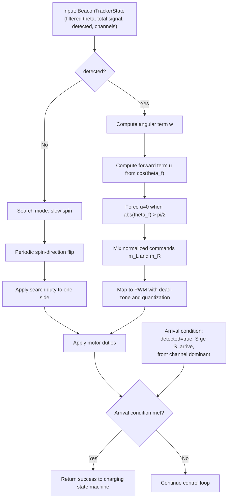

## Control update

Drive control runs at a fixed period in `slave` firmware (20 ms target).

Inputs are taken from `BeaconTrackerState`.

## Control pipeline

## Controller

With filtered angle $\theta_f$:

- $w = \operatorname{clamp}(K_p \cdot \theta_f + w_{\mathrm{jitter}},\,-w_{\max},\,w_{\max})$
- $u = u_{\max} \cdot \max(0, \cos(\theta_f))$
- if $|\theta_f| > \pi/2$, $u = 0$
- $m_L = \operatorname{clamp}(u - w,\,0,\,1)$
- $m_R = \operatorname{clamp}(u + w,\,0,\,1)$

$m_L$ and $m_R$ are normalized motor commands in $[0, 1]$.

The `slave` firmware injects a small wall-jitter steering term only when likely near a head-on wall:

- $\mathrm{detected} = \mathrm{true}$
- front channel dominant
- $S \ge 1800$
- $|\theta_f| \le 0.28 \text{ rad}$

Then $w_{\mathrm{jitter}}$ flips between $\pm 0.14$ every 240 ms.

## Dead-zone compensation

Normalized commands are mapped to PWM duty:

- $0 \rightarrow 0$ (off)
- $(0, 1] \rightarrow [\mathrm{duty\_deadzone}, \mathrm{duty\_max}]$

Duties are quantized to avoid tiny duty steps and unstable low-level drive.

## Search behavior

If $\mathrm{detected} = \mathrm{false}$, slave enters search mode:

- slow spin on one side
- periodic direction flip to avoid deadlock

Search exits immediately when valid beacon detection returns.

## Arrival condition

Navigation step returns success when all are true:

- $\mathrm{detected} = \mathrm{true}$
- $S \ge S_{\mathrm{arrive}}$
- front channel is dominant

This condition feeds the existing autocharge state machine without protocol changes.

## Baseline tuning constants

Current firmware defaults:

- $K_p = 0.70$
- $w_{\max} = 0.65$
- $u_{\max} = 0.75$
- $S_{\mathrm{arrive}} = 4250$
- $\mathrm{duty\_deadzone} = 3300$
- $\mathrm{duty\_max} = 4600$
- $\mathrm{search\_duty} = 3560$

Treat these as starting values and tune on hardware.
