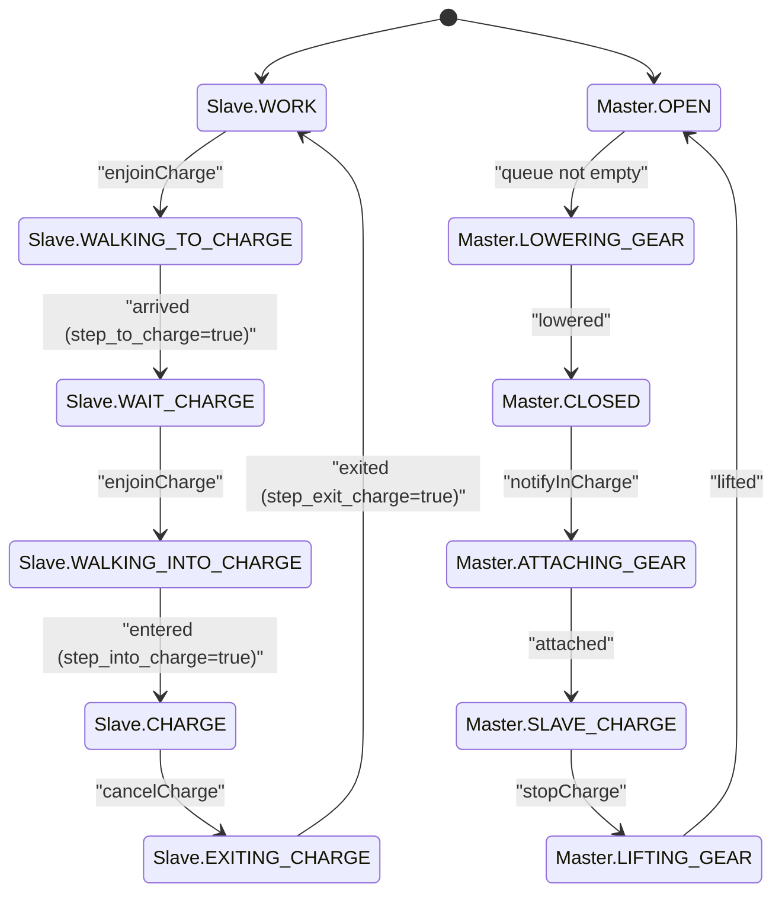

## Scope

Charging is a distributed state machine:

- `slave/` owns robot navigation and local charging phases.
- `master/` owns station gear states and scheduling.
- Mesh commands/events synchronize both sides.

## Slave states

Defined in `SlaveState`:

- `WORK`
- `WALKING_TO_CHARGE`
- `WAIT_CHARGE`
- `WALKING_INTO_CHARGE`
- `CHARGE`
- `EXITING_CHARGE`

### Slave transition conditions

| From                  | To                    | Condition                                           |
| --------------------- | --------------------- | --------------------------------------------------- |
| `WORK`                | `WALKING_TO_CHARGE`   | receives `enjoinCharge` from master                 |
| `WALKING_TO_CHARGE`   | `WAIT_CHARGE`         | `step_to_charge()` returns `true` (arrival reached) |
| `WAIT_CHARGE`         | `WALKING_INTO_CHARGE` | receives `enjoinCharge` from master                 |
| `WALKING_INTO_CHARGE` | `CHARGE`              | `step_into_charge()` returns `true`                 |
| `CHARGE`              | `EXITING_CHARGE`      | receives `cancelCharge` from master                 |
| `EXITING_CHARGE`      | `WORK`                | `step_exit_charge()` returns `true`                 |

Cancellation behavior from master (`cancelCharge`) is state-dependent:

- from `WALKING_TO_CHARGE`, `WAIT_CHARGE`, `WALKING_INTO_CHARGE`: transition to `WORK`
- from `CHARGE`: transition to `EXITING_CHARGE`
- from `WORK`: remain in `WORK`

### Project-specific arrival condition (`step_to_charge`)

In current `slave/src/main.cpp`, `step_to_charge()` returns `true` only when all are true:

- `detected == true`
- `totalSignal >= SIGNAL_ARRIVE`
- front channel is dominant (`front >= back/left/right`)

## Master states

Defined in `ChargingStationState`:

- `OPEN`
- `LOWERING_GEAR`
- `CLOSED`
- `ATTACHING_GEAR`
- `SLAVE_CHARGE`
- `LIFTING_GEAR`

### Master transition conditions

| From             | To               | Condition                                          |
| ---------------- | ---------------- | -------------------------------------------------- |
| `OPEN`           | `LOWERING_GEAR`  | waiting queue (`chargingSlaves`) becomes non-empty |
| `LOWERING_GEAR`  | `CLOSED`         | `stepLowerGear()` returns `true`                   |
| `CLOSED`         | `ATTACHING_GEAR` | receives slave notify `notifyInCharge`             |
| `ATTACHING_GEAR` | `SLAVE_CHARGE`   | `stepAttachGear()` returns `true`                  |
| `SLAVE_CHARGE`   | `LIFTING_GEAR`   | receives slave command `stopCharge`                |
| `LIFTING_GEAR`   | `OPEN`           | `stepLiftGear()` returns `true`                    |

Additional `OPEN` transition path:

- On slave notify `notifyExitCharge`, master sets `currentChargingSlave = nullptr` and state `OPEN`.

## Mesh messages involved

Commands from master to slave:

- `enjoinCharge`
- `cancelCharge`

Events/requests from slave to master:

- `requestCharge`
- `stopCharge`
- `notifyWork`
- `notifyWalkToCharge`
- `notifyInWait`
- `notifyWalkIntoCharge`
- `notifyInCharge`
- `notifyExitCharge`

## End-to-end nominal cycle

1. Slave in `WORK` sends `requestCharge`.
2. Master commands `enjoinCharge`; slave transitions to `WALKING_TO_CHARGE`.
3. Slave arrives, transitions to `WAIT_CHARGE`, sends `notifyInWait`.
4. Master queues slave, lowers station gear (`OPEN -> LOWERING_GEAR -> CLOSED`).
5. Master commands `enjoinCharge`; slave transitions to `WALKING_INTO_CHARGE`.
6. Slave enters and transitions to `CHARGE`, sends `notifyInCharge`.
7. Master transitions `CLOSED -> ATTACHING_GEAR -> SLAVE_CHARGE`.
8. Slave requests `stopCharge`.
9. Master transitions `SLAVE_CHARGE -> LIFTING_GEAR -> OPEN`, then sends `cancelCharge`.
10. Slave transitions `CHARGE -> EXITING_CHARGE -> WORK`, sends `notifyExitCharge`/`notifyWork`.

## Diagram

